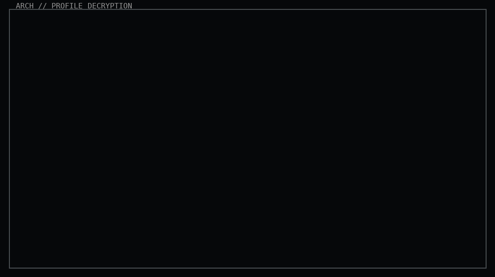
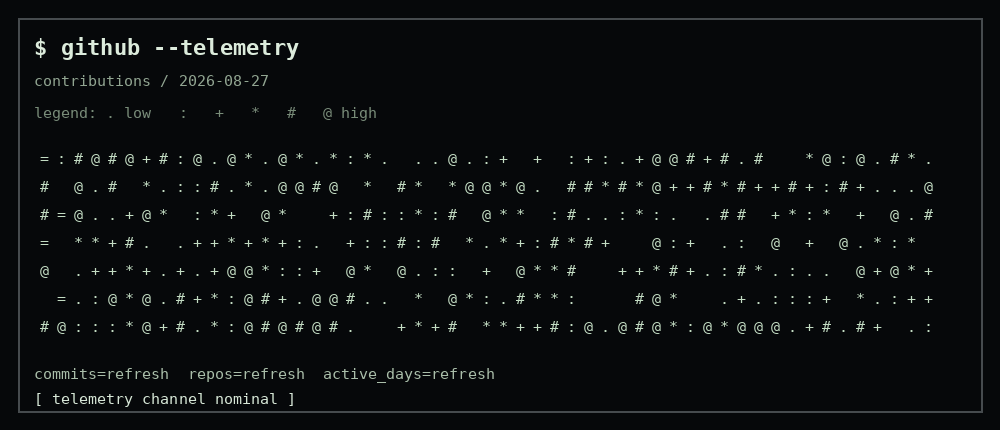

<!--
Sakif16 profile README
Custom animation assets:
  - assets/boot.gif      = ASCII boot / rain / pile-up / cryptography / reveal
  - assets/telemetry.gif = ASCII contribution telemetry
No SVGs or JavaScript are used for the custom animated panels.
-->

<p align="center">
  
</p>

<p align="center">
  <a href="https://www.linkedin.com/in/sakib-muhtasim-8b8b69293/"></a>
  <a href="https://github.com/Sakif16"></a>
</p>

```text
┌──────────────────────────────────────────────────────────────────────────────┐
│ $ whoami                                                                    │
├──────────────────────────────────────────────────────────────────────────────┤
│                                                                              │
│  SAKIB MUHTASIM                                                             │
│  Computer Science & Engineering                                              │
│                                                                              │
│  I build web applications, experiment with robotics, and enjoy working      │
│  close to the system when a problem gets interesting.                       │
│                                                                              │
│  focus :: full-stack development • robotics • systems • problem solving      │
│                                                                              │
└──────────────────────────────────────────────────────────────────────────────┘
```

## `~/projects`

```text
┌──────────────────────────────────────────────────────────────────────────────┐
│ $ ls -la ~/projects                                                         │
├──────────────────────────────────────────────────────────────────────────────┤
│                                                                              │
│  Khoroch       expense tracker                                              │
│  Nobojatra     collaborative / real-time web project                        │
│  Study Buddy   academic productivity project                                │
│  Moosik        web project                                                  │
│  Snitch        web project                                                  │
│  Goal Table    Next.js project                                              │
│                                                                              │
└──────────────────────────────────────────────────────────────────────────────┘
```

<a href="https://github.com/Sakif16/nobojatra"></a>
<a href="https://github.com/Sakif16"></a>

## `$ github --telemetry`

<p align="center">
  
</p>

```text
┌──────────────────────────────────────────────────────────────────────────────┐
│ $ git log --oneline --decorate                                              │
├──────────────────────────────────────────────────────────────────────────────┤
│                                                                              │
│  build → break → debug → learn → repeat                                     │
│                                                                              │
│  contributions are not a scoreboard; they're a trace of things being built. │
│                                                                              │
└──────────────────────────────────────────────────────────────────────────────┘
```

## `$ cat ~/.tech-stack`

```text
LANGUAGES
  C++          Python          TypeScript

FRONTEND
  React        Next.js         Tailwind CSS

BACKEND
  Node.js      Express.js      PHP

DATA
  MongoDB      MySQL           Prisma

AI / ML
  TensorFlow   PyTorch         scikit-learn

SYSTEMS / EMBEDDED
  Arduino      Raspberry Pi    ESP32

PLATFORM / DEVTOOLS
  Git          GitHub          Render          Cloudflare
```

<p align="center">
  
</p>

## `$ neofetch`

```text
┌──────────────────────────────────────────────────────────────────────────────┐
│                                                                              │
│  OS        Arch Linux                                                       │
│  WM        Hyprland                                                         │
│  SHELL     zsh                                                              │
│  STATUS    building                                                         │
│                                                                              │
└──────────────────────────────────────────────────────────────────────────────┘
```

## `$ stats`

<p align="center">
  
  
</p>

```text
$ echo "keep building."

          /\_/\
         ( o.o )
          > ^ <
```

<!--
Telemetry refresh:
  .github/workflows/telemetry.yml
-->
